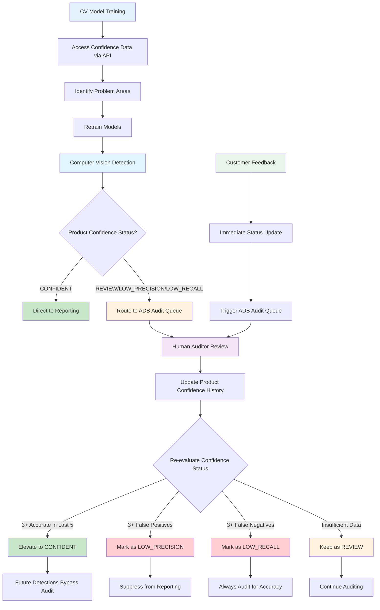

Feedback Loops is Simbe's unified framework for catching, suppressing, and resolving product-level data inaccuracies before they reach customer analytics. Feedback Loops uses an intelligent product-level audit workflow to accelerate store onboarding, reduce audit burden, and preserve trust in every metric we publish.

Two specialized flows—Feedback Loops for Out on Shelf and Feedback Loops for Standard Price—extend this framework to our two primary data domains: shelf availability detections and standard price exceptions.

## What Are Feedback Loops?

Feedback Loops create intelligent, automated workflows that learn from audits and customer feedback to continuously improve data quality. The system builds confidence in product-level detections by analyzing historical patterns over time and automatically routing low-confidence items for human review.

The system maintains a running history of detection accuracy for each product, requiring multiple consistent observations before elevating a product to "CONFIDENT" status. When customers report false positives, this feedback immediately triggers re-evaluation and can demote products to lower confidence levels. Product confidence is dynamic and adapts based on new information, creating a continuously improving system that builds on its past experiences.

## System Flow Overview

## Key Benefits

- **Accelerated Onboarding**: New stores can go live faster with intelligent audit routing and confidence-based reporting
- **Reduced Manual Work**: Automated suppression of low-confidence detections and false positives
- **Continuous Improvement**: System learns from corrections to improve future accuracy and CV model retraining
- **Trusted Analytics**: Only high-confidence data reaches customer reporting
- **Automated Audit Routing**: Direct connection between user feedback and ADB auditing processes

## How It Works

### 1. Detection & Flagging
Computer vision systems detect potential issues (price mismatches, out-of-stock items) and flag them for review.

### 2. Confidence Status Assessment
The system evaluates each detection against the product's historical performance, including past audit outcomes and customer feedback patterns. Products are assigned confidence statuses (CONFIDENT, REVIEW, LOW_PRECISION, LOW_RECALL) that determine reporting and audit routing.

### 3. Intelligent Routing & Suppression
Based on confidence levels, the system automatically routes low-confidence items to human auditors while allowing high-confidence detections to bypass review. False positives are automatically suppressed from reporting.

### 4. Continuous Learning & Feedback Integration
Every audit outcome and customer feedback is recorded and integrated into the product's confidence history. The system automatically updates confidence statuses and triggers ADB audit queues for products requiring review.

### 5. CV Model Improvement
Confidence statuses and related job context (like fixture type) are made available to the CV team through API endpoints, enabling faster identification of problem areas and streamlined model retraining.

## Two Main Workflows

### [Feedback Loops for Out on Shelf](/internal/services/feedback-loops/out-on-shelf)
Manages shelf availability detections by tracking product-level accuracy through a sophisticated confidence status system. Products can start in "REVIEW" status during onboarding (when PEM_OOS_REVIEW_BY_DEFAULT is enabled) and graduate to "CONFIDENT" status after demonstrating consistent accuracy. The system continuously learns from user feedback and audit corrections, automatically queuing jobs for ADB review and maintaining confidence status history.

### [Feedback Loops for Standard Price](/internal/services/feedback-loops/standard-price)
Handles price discrepancy exceptions, enabling store teams to flag false positives directly in the mobile app or web-based task reports. When feedback is submitted, those items are automatically suppressed from future reporting, reducing alert fatigue and improving trust in pricing insights.

## Getting Started

To use Feedback Loops in your stores:

1. **Enable Services**: Add the appropriate Feedback Loops services to your store configuration
2. **Configure Confidence Settings**: Choose whether to default new products to REVIEW status during onboarding
3. **Train Your Team**: Ensure store teams understand how to flag false positives and auditors understand the new workflow
4. **Monitor Performance**: Use the available dashboards to track system performance and improvements

## Required Services

### Out on Shelf
- **PEM_OOS_REVIEW_BY_DEFAULT** (optional): Initializes every new product to REVIEW status, suppressing it from reporting until proven accurate
- **PEM_AUTO_AUDIT**: Controls queuing jobs for ADB to audit
- **PEM_PRODUCTION**: References confidence status and sets is_out_on_shelf to null for low-confidence products

### Standard Price
- **PEM_PRICE**: Enables price exception workflows and false positive suppression

## Learn More

- [Out on Shelf Workflow Details](/internal/services/feedback-loops/out-on-shelf)
- [Price Exception Management](/internal/services/feedback-loops/standard-price)
- [Development Guide](/development)

[← Back to Overview](/overview)
